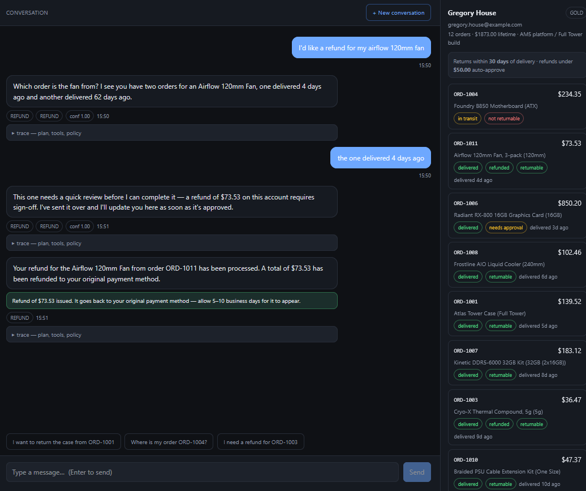
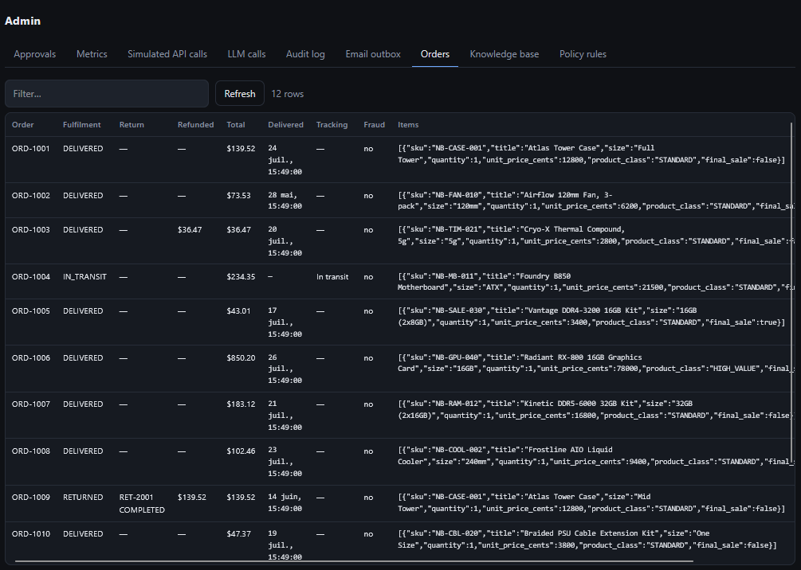

# AI Agentic Customer Support

An AI agentic system for e-commerce customer support. A small team of AI agents figures out
what they want, looks up the facts, and either resolves it or escalates to a
human.

The agents never execute anything themselves. They *propose* an action like a
refund or a return, a policy engine decides whether it is allowed or needs a
human or is refused, and a separate tool executor is the only thing that can
actually run it.

Built on LangGraph and Gemini on Vertex AI, with RAG over pgvector. The
external services, like Stripe, are simulated: the project is
about the agents flow, the retrieval, the policy logic and the human handoff, not
about integrating a payment API.

## What it does

A customer opens the chat and talks to an agent, the way they would to a support
rep:

- *"Where is my order?"* → the agent looks up the real order and fulfilment status
- *"Will this memory work in my board?"* → answered from the knowledge base
- *"I want a refund for ORD-1042"* → the agent checks the order, the payment and
  the refund policy, then refunds it — or explains why it can't
- *"This arrived broken"* → damage flow, return label, replacement or refund
- *"Let me talk to a human"* → escalation

Small refunds go through automatically. Anything above the threshold, out of
policy, or on a risky account stops and lands in a human approval queue on the
admin page. Approve it and the original conversation resumes and executes,
reject it and the customer gets a real explanation.

## How it works

Being a demo build, there is a **single customer** (no login) and an
**unprotected `/admin` page** for the support/ops side, covering approvals,
orders, logs, metrics and policy rules.

When a message arrives, the graph runs these in order, each tagged with what
actually runs it:

1. **Load the context**: who this customer is (past returns, tickets,
   preferences) and what was already said in this conversation.
2. **AI Router**: reads the message and says *what the customer wants*
   (`REFUND`, `RETURN`, `EXCHANGE`, `TRACK_ORDER`, `PRODUCT_QUESTION`,
   `WARRANTY`, `DAMAGE`, `GENERAL_QA`, `HUMAN`), plus a confidence, a sentiment,
   the entities it could pull out and an injection assessment. Which specialist
   handles the turn follows from that intent.
   ↳ *The graph branches here.* A prompt injection, an explicit request for a
   human, anger, or low confidence sends the turn straight to the approval
   queue — no planning, no retrieval, no tools.
3. **AI Planner**: turns the intent into an ordered plan of steps. It's
   advice for the specialist, not control: it cannot change what runs next.
4. **RAG retrieval**: pulls the relevant policy and FAQ
   passages out of pgvector so the agent argues from the actual written policy,
   not from memory.
5. **AI Specialist agent**: one per domain (Refund, Return, Exchange,
   Shipping, Warranty, Damage, Q&A). It *proposes* tool calls; it never executes
   them. If it's missing something it needs, it asks the customer a clarifying
   question instead.
6. **Policy engine**: plain Python, reads database rows. Returns
   `ALLOW`, `REQUIRES_APPROVAL` or `DENY`. This is the gate.
   ↳ *The graph branches here.* `ALLOW` runs the tools. `DENY` skips ahead to the
   reply. `REQUIRES_APPROVAL` freezes the conversation in Postgres and queues it,
   to resume at this exact point when a human decides.
7. **Registry**: the list of the fake tools, and the executor that runs
   them. It re-evaluates the gate itself before dispatching, and each agent only
   sees the tools for its own job.
8. **AI Responds**: explains what *actually* happened. It runs after the
   policy engine, so it can't promise a refund that just got blocked.

## Screenshots

### 1. A refund that goes through

A customer asks for a refund on an in-window order, under the auto-approve
threshold. Router → Refund agent → policy `ALLOW` → simulated Stripe refund →
confirmation, in one turn, with no human involved.



### 2. The admin page

Orders, payments, refund state and the approval queue — the operator's view of
the same data the agents are reading.



## Stack

| Layer | What |
|---|---|
| Frontend | Vue 3 + Vite
| Backend | FastAPI
| Orchestration | LangGraph, (checkpointed into the same Postgres, to resume approval requests)
| LLM | Gemini Vertex AI
| Data | Postgres 16 + pgvector, SQLAlchemy
| Infra | Docker Compose

## Run it

Set the vars in .env:
```bash
VERTEX_PROJECT_ID=your-gcp-project
VERTEX_LOCATION=us-central1
# the actual path to your service account key file, on the host
GOOGLE_CREDENTIALS_FILE=/path/to/service-account.json
```

Then, run:
```bash
docker compose up -d
```

The API seeds itself on startup (`SEED_ON_STARTUP=true`): the relational data if
the tables are empty, and the knowledge corpus on every boot. No separate
seeding step. To wipe and start over:
```bash
docker compose exec api python /srv/scripts/seed.py --reset
```

## What is where

| Path | What |
|---|---|
| `backend/app/policy/engine.py` | The hard gates. Deterministic, reads rows, not model output |
| `backend/app/tools/registry.py` | Tool schemas + the executor no agent can bypass |
| `backend/app/graph/workflow.py` | The state machine, checkpointing and the approval pause |
| `backend/app/agents/` | Router, planner...
| `backend/app/rag/` | Chunk - embed - pgvector - retrieve
| `backend/app/integrations/` | The fake Shopify / Stripe / CRM / Email |
| `backend/app/api/` | Chat and the admin surface |
| `frontend/src/` | Vue 3 pages |
| `backend/app/security/injection.py` | Prompt-injection detection, deterministic patterns |
| `seed/` | The corpus and the testing scenarios |

## The tools (Mocked up)

Shopify, Stripe, CRM and Email are mocked up: same argument shapes and same
failure modes as the real APIs, but every one of them just reads and writes our
own Postgres tables.

| Group | Functions | Count |
|---|---|---|
| Shopify | orders, customers, tracking, stock, returns, exchanges, cancellations | 7 tools |
| Stripe | payment lookups, refunds, partial adjustments | 4 tools |
| CRM | tickets, customer history, escalation | 5 tools |
| Email | confirmations, return labels, support alerts | 3 tools |

Lookups run freely — the agent needs them to explain itself. Two thirds of the
tools write, and the four that move money or create an obligation (return,
exchange, refund, adjustment) can't run at all until the policy engine clears
them.

## Technical details

<details>
<summary>More details</summary>

**When it escalates.** Five triggers fire before any tool runs — a detected
prompt injection at HIGH severity, an explicit request for a human, `ANGRY`
sentiment, routing confidence under 0.6 on anything but a general question, and
a policy verdict of `REQUIRES_APPROVAL`. A sixth fires after: repeated tool
failures. Injection, anger and human-requested land in the queue at HIGH
priority; the rest at NORMAL.

**Retries and multi-round tool calls.** A turn is not one batch of calls. If a
round only *read*, the agent gets another round — the refund agent cannot know a
payment id before `Shopify.GetOrder` returns, and with a single batch it would
fill the gap by claiming a refund that never happened. Failed calls are retried
with the failure text in context, up to `max_refund_retries` (a policy rule, not
a constant), then escalate.

**Idempotency.** `Shopify.CreateReturn`, `Shopify.CreateExchange` and
`Stripe.RefundPayment` take an idempotency key, so approving the same pending
action twice is a no-op rather than a second refund.

**Memory.** Short-term is the last 12 messages. Long-term is derived from rows that
already exist — past returns, tickets, stored preferences — rather than from a
summarisation pass, so it can't hallucinate a preference the customer never
expressed.

**Everything is logged as rows.** `api_logs` (every simulated integration call),
`llm_calls` (prompt, response, tokens, latency), `audit_logs` (every state
change), all queryable from `/admin`.

**Policy rules live in the database — including inside the RAG corpus.**
Thresholds are `policy_rules` rows, not constants, so `/admin` can edit the $50
gate and the next request uses the new value. The `.env` values are bootstrap
only. The knowledge documents hold the *sentences* and write the numbers as
`{{refund_auto_approve_under_cents|money}}` placeholders, resolved against those
same rows on the way out of retrieval. One edit therefore moves what the engine
enforces and what the agent tells the customer together — the retrieved text
cannot quote a threshold that is no longer in force.

**The seed is a scenario matrix, not filler.** 12 orders chosen for test cases:
inside the window, 62 days out, still in transit... Three failures are rigged on
purpose — a malformed payload, a declined payment, a permanently out-of-stock
variant. To test what the agent does when a tool misbehaves.

**It runs without credentials.** With Vertex unconfigured the app still boots,
seeds and serves `/admin`; only chat degrades, and it replies with a plain
sentence naming the variable you need to set.

</details>